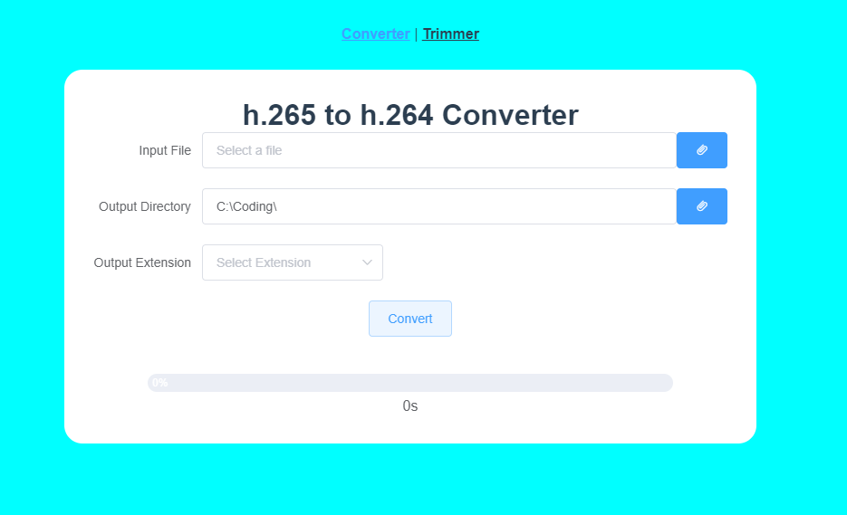

# vue-video-converter



This is an ElectronJS application, with [VueJS](https://vuejs.org/) as frontend. If you choose to use this application, feel free to download the First version release from [this link](https://github.com/zernonia/vue-video-converter/releases/tag/1)

If you choose to contribute or fork this project, feel free to do so.

## Project setup
```
npm install
```

### Compiles and hot-reloads for development
```
npm run electron:serve
```

### Compiles and minifies for production
```
npm run electron:build
```

### Lints and fixes files
```
npm run lint
```

### Customize configuration
See [Configuration Reference](https://cli.vuejs.org/config/).
